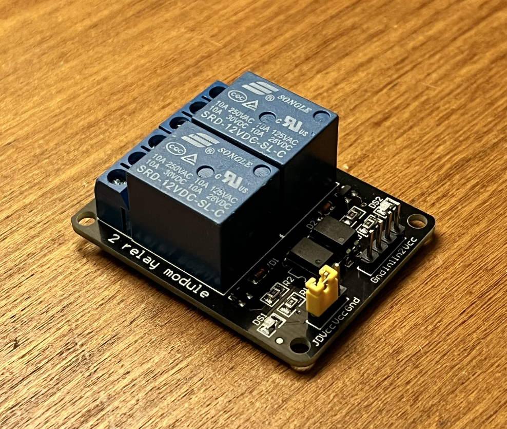

# Part 1: Smart lights

In this part of the project, my goal was to make a lightbulb that connects to wifi and subscribes to a specific topic on my MQTT broker. I ended up setting up two different lights: one with a Raspberry Pi, and one with an esp32.

## Setting up a DIY smart light with an esp32

### Wiring it up

For this part, I needed to wire up two things: a switch and the relay module. In this case I used a two channel relay to control a small desklamp that I have. 

The switch was be wired up to pins 13 an GND. The relay module connected to pins 27, VCC and GND. After that, I substituted the switch of the desklamp with the relay module. Remember: this part is a little bit dangerous because it deals with wall power!

### Programming it

If you want to try this yourself, you'll need to edit a little bit of code! In esp32.ino, you'll need to set the correct hostname and port for the mqtt server, as well as your wifi credentials. You can also customize the topic the esp32 will listen to.

I usually use arduino-cli to flash code on microcontrollers. To be able to flash this code with arduino-cli, first its important to run the preinstall, which will install some needed libraries and platforms, and then run `make upload` to send the code to the board. At this stage its important to check if the board is mounted to /dev/ttyUSB0.

# Setting up a DIY smart light with a Raspberry Pi

I ended up wanting to automate my second desk lamp, and I took advantage of the face I already had a Raspberry Pi set up at the other side of my table to turn on my pc remotely (I should probably document that somewhere, because is a fun and stupid project that I did). Because of that, I ended up just adding a relay module to it and programming a little bit od python code to connect to the mqtt broker.

## Wiring it up

To connect the Raspbery Pi, I simply wired up the button between pin 17 and GND. The relay module needed pins 27, VCC and GND. After that, just like before, I substituted the lamp switch with the relay module.

## Setting up the software

After installing Raspberry Pi OS to the raspberry pi, I just made a copy of button.py and mqtt.py in the Pi home directory. If you want to follow along, remember to change the hostname and port of the broker in the mqtt.py file! To run the code every time at startup, I used two things: tmux and crontab. Crontab comes with basically any standard linux installation. To install tmux on a raspberry pi, just type `sudo apt install tmux`.

After that, I ran `crontab -e` and added these lines to the end of the file:

    @reboot tmux new-session -d -s "mqttSub" "python3 /home/pi/mqtt.py"
    @reboot tmux new-session -d -s "button" "python3 /home/pi/button.py"

After that, I just saved the file and rebooted the pi to check if everything was working. If everything goes right, you should see 2 sessions open on tmux when it reboots:

    pi@LeLights:~/ # tmux ls
    button: 1 windows (created Sat Aug 26 05:36:02 2023) [80x24]
    mqttSub: 1 windows (created Fri Sep  1 00:54:23 2023) [80x24]

Now, sending a packet should turn on the lights!