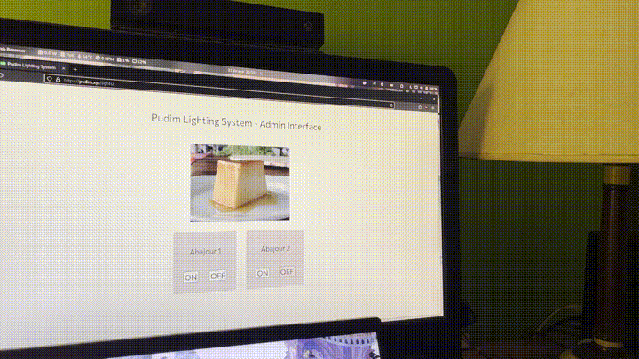

### This project is now obsolete. Check ouy [neoPudimLights](https://github.com/LeRenner/neoPudimLights)

# Pudim Lights

This repository documents the DIY smart lights I set up in my room, and the system behind them. They can be turned on with a button, with a website, or anything else connected to the internet! 

## How it works

This system has three parts: the smart lights, the mqtt broker, and an HTTP API. If you want to follow along, detailed instructions are written in the directories for each of the steps. Small disclaimer: this project deals with mains voltage, which can be dangerous. Keep in mind that if you mess up you could fry electronics, or even cause a fire! Please be cautious.

The first part (and most involved) part of this project is making a lightbulb that connects to an MQTT broker and turns on or off whenever it receives packets. I have two lights, and each one uses a different microcontroller: Raspberry Pi and an esp32. The code I wrote for both is in the directory 1-smartLights.

For the second part, I set up an MQTT broker. It receives messages from some computers, and sends it to others. Originally it was set up on docker, but nowadays it is a deployment inside my home k8s cluster. I chose to use MQTT for the communication on my local network because it is simple, lightweight and perfect for this kind of application. This way, to turn ON or OFF any of the lights, I just sent an MQTT packet to the broker. This part is documented on 2-mqttBroker.

Now, to make this system easy to integrate into any other program, I wrote a simple API that allows me to turn on or off my lights from anywhere. It even allows my friends to turn them on, which ended up being something very funny.

## Turning ON and OFF the lights

After setting up everything, I just need to send a publish request to the MQTT broker with the topic `PLS/1` or `PLS/2` (1 and 2 being the two lights I set up) with contents `0` to turn it OFF, and `1` to turn it ON. With the API set up, I can also send an HTTP request to my k8s cluster at /1/on to turn on light 1, for example.
